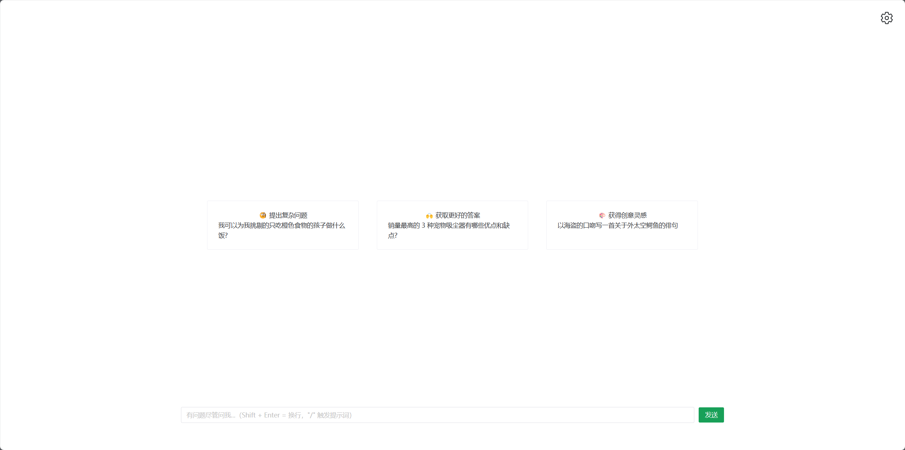
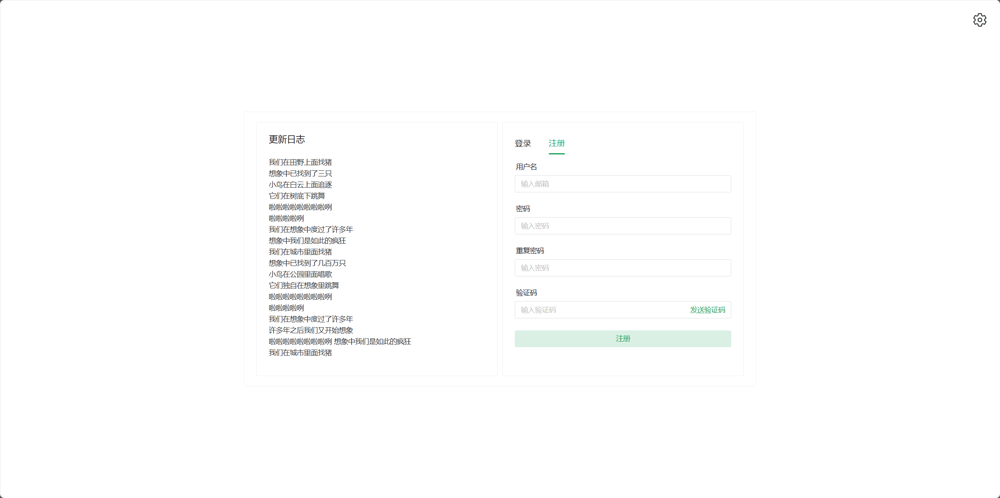
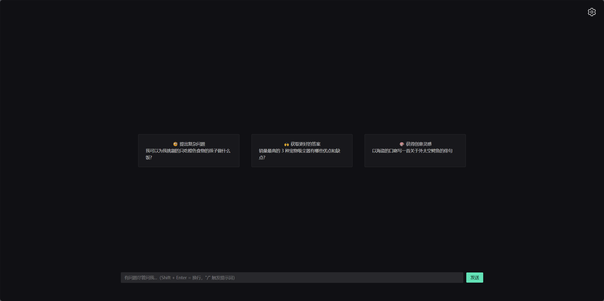
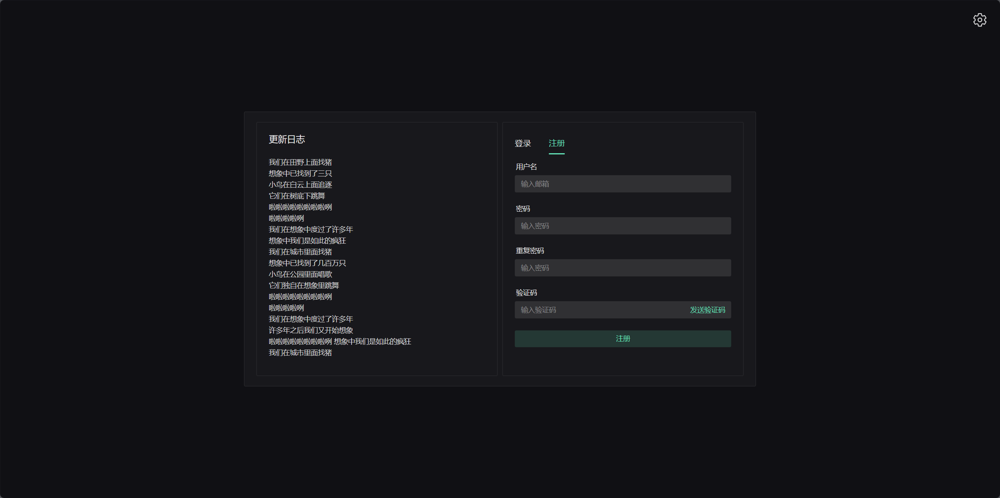
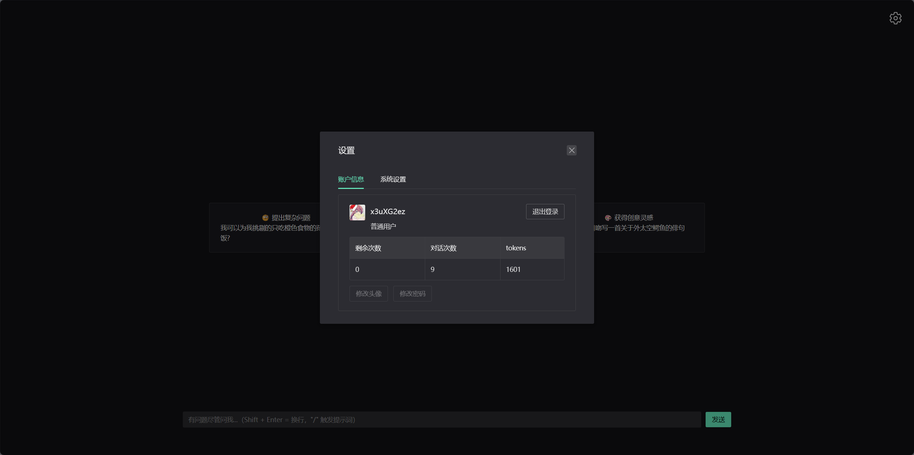
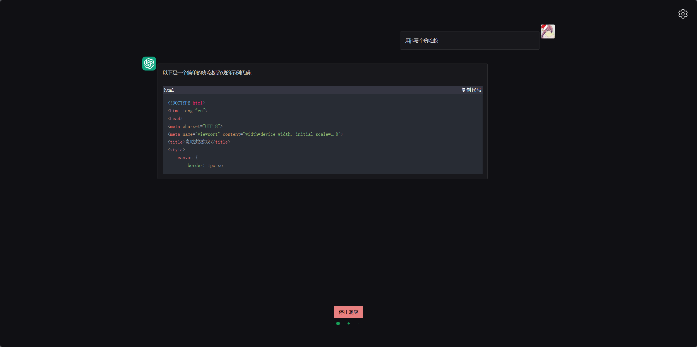
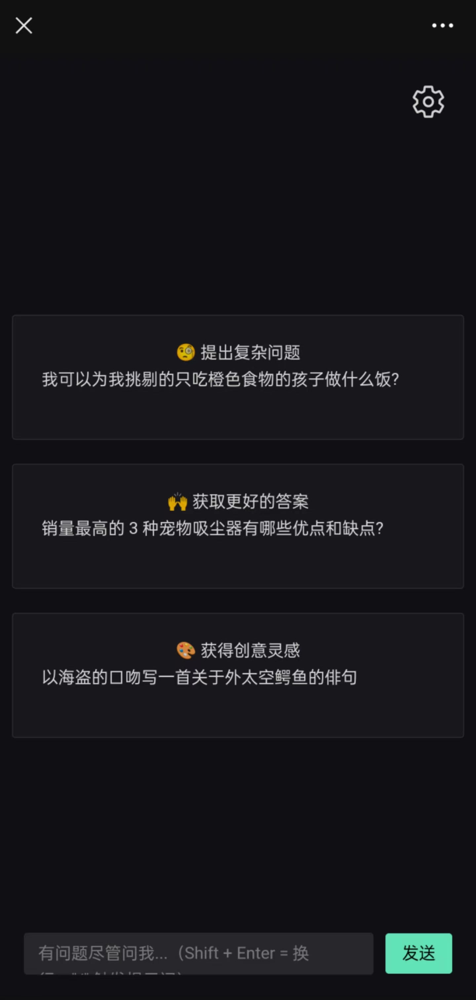
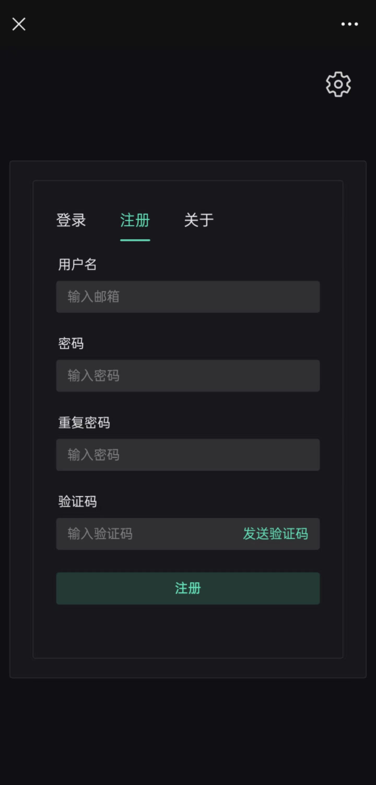

# ChatGPT-allai-client

## 介绍

简约版 `ChatGPT`使用 SSR 渲染，**项目上线后可在各大搜索引擎搜索到，欢迎 star**
后续会接入世界上所有 ai 接口，国内支付宝和微信支付,国外 PayPal，采用 javascript 编写全栈项目
此项目没有过度封装，小白都能看懂，主打简洁，可不断完善！

前端`Nuxt3+Naive-ui`<br /> 
后端`Nest+Mysql` <br />
gitee地址(https://gitee.com/zmzm666/chatgpt-allai-client) <br />
github地址(https://github.com/OnZeng/chatgpt-allai-client) <br />
接口文档(https://apifox.com/apidoc/shared-f06bc49e-3ecb-4971-a254-d46446faaa5a)

### 微信交流群


## 项目效果

不是最终效果，后续会不断优化

### PC 端

<table>
    <tr>
        <td ><center>图1</center></td>
        <td ><center>图2</center></td>
    </tr>
    <tr>
        <td ><center>图3</center></td>
        <td ><center>图4</center></td>
    </tr>
    <tr>
        <td ><center>图5</center></td>
        <td ><center>图6</center></td>
    </tr>
</table>

### 手机端

<table>
    <tr>
        <td ><center>图1</center></td>
        <td ><center>图2</center></td>
    </tr>
</table>

## 项目运行

```
    # 安装依赖
    npm install

    # 启动项目
    npm run dev

    # 打包项目
    npm run build
```
